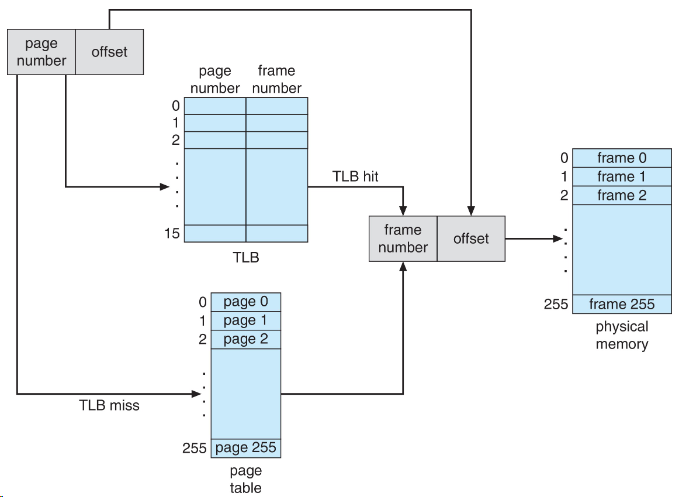

# Virtual Memory Manager

This repository contains an implementation of a program that translates logical addresses into physical addresses for a virtual address space of size 65,536 bytes. The program reads logical addresses from a file, translates them using a Translation Lookaside Buffer (TLB) and Page Tables, and outputs the value of the byte stored at the translated physical address.

The objective of this assignment is to understand the steps involved in the translation of logical addresses into physical addresses through simulation. This includes handling page faults using demand paging, managing a TLB, and implementing a page replacement algorithm.

# Usage

To run the program, follow these steps:

    $ cd betriebssysteme_public/hausuebung/hu2/memory/
    $ mkdir build
    $ cd build
    $ cmake ../
    $ make

    $ ./vmm --backing ../BACKING_STORE.bin ../addresses.txt

# File Format

The logical addresses are provided in *addresses.txt*, with each address on a separate line and integer value ranging from 0 to 65535.

This repository includes two files, *correct-256.txt* and *correct-64.txt*, which contain the correct output values for the addresses.txt file under different assumptions regarding the memory size.
### correct-256.txt

The *correct-256.txt* file contains the correct output values for the *addresses.txt* file, assuming that the memory size is equal to the size of the virtual address space, which is 256 frames.
### correct-64.txt

The *correct-64.txt* file contains the correct output values for the submission version of the program, considering a reduced main memory size of 16,384 bytes or 64 frames.

The main memory size can be reduced in *vmm.h* by changing the value of the constant `FRAME_COUNT` to 64 or 256.
These files serve as references for validating the output of the program against the expected results.

### Sample Output
    Virtual: 16916, Physical: 20, Value: 0, TLB hit: false, PT hit: false
    Virtual: 62493, Physical: 285, Value: 0, TLB hit: false, PT hit: false

# Implementation Details

The program employs a Translation Lookaside Buffer (TLB) and Page Tables to perform the virtual-to-physical address translation. It utilizes a demand paging mechanism to handle page faults and a page replacement algorithm to manage the TLB.
